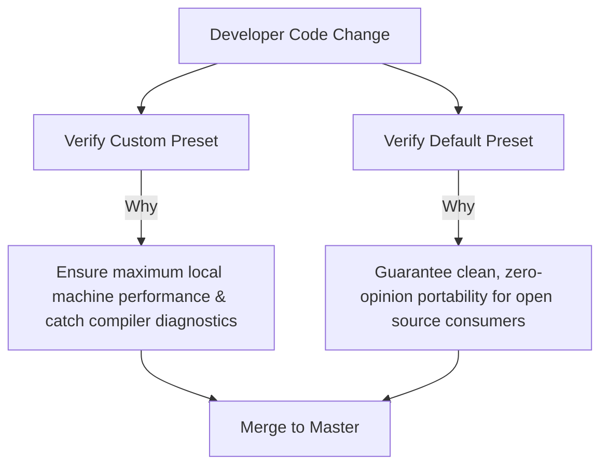

# Skill: CMake Coding Standards & Style Guide

This guide defines the standards for writing CMake configurations in the `template2026` project. The project adheres to Modern CMake principles (CMake 3.23+), ensuring minimal duplication (DRY) and multi-compiler support.

---

## 1. The Symmetry Principle: Directory == Target == Translation Unit

In this project, a strict architectural rule is enforced: **Directory Name == Target Name == Translation Unit File Name == Library Object Name**. 

This constraint creates a workspace symmetry that provides three characteristics:

### 1. Eliminating the Naming Mapping Mental Tax
In many standard C++ projects, developers experience naming drift: a folder is named `utils/`, the CMake library target is `utility_lib`, the source file is `helper.cpp`, and the namespace is `my_project::common`. 

This layout forces developers to translate between directory structures, include headers, and link targets in their heads. In this project, this translation is eliminated: knowing the folder name `foo` guarantees that:
- The target name is `foo`.
- The source file is `foo.cpp`.
- The header path is `foo/foo.hpp`.
- The internal dependency link target is `${PROJECT_NAME}::foo`.

> **Core Architectural Philosophy**:
> It physically prevents spaghetti code. Because you cannot use a class from another target without explicitly linking to it in CMake, compilation boundaries are ironclad. It forces developers to write modular, decoupled C++ code.

#### Source File Boundaries and Private Helpers
In this symmetrical design, it is architecturally acceptable to include multiple `.cpp` source files in a target if they constitute private helper implementations that:
* Are only consumed internally within that specific target.
* Are not referenced or linked directly by other targets.
* Exist solely to maintain target source file modularity and structure.

Criteria for isolating implementation details into a new target and directory:
* If the implementation includes a class or function that other targets must reference or link against, the Symmetry Principle requires placing it in its own directory as a separate target. This enforces compilation boundaries and maintains a decoupled dependency graph.


### 2. Naming Refactoring (Automated Renaming)
If an internal library needs to be renamed during active refactoring, standard projects require changing directory names, modifying target definitions, updating file references, editing parent inclusions, and updating every place where it is linked in the build graph.

In this symmetrical design, renaming a library is automated. Because of dynamic directory-name bindings, renaming the directory automatically renames the target, the source tracking, and the entire build graph. Changing the folder name is the only action required.

### 3. Centralized Target Templates
Because all target properties and compilation options are uniform across the codebase, they are defined in a centralized location rather than duplicated inside individual library target files. This keeps targets DRY.


---

## 2. Dynamic Target Resolution & Target Aliasing

To support the Symmetry Principle, target names are dynamically resolved from their directory location using `cmake_path` (introduced in CMake 3.20):

```cmake
# Dynamic target binding to current directory name
cmake_path(GET CMAKE_CURRENT_LIST_DIR FILENAME DIR_NAME)

# Library registration
add_library(${DIR_NAME})

# Export namespaced ALIAS target for global consumption
add_library(${PROJECT_NAME}::${DIR_NAME} ALIAS ${DIR_NAME})
```

---

## 3. The Executable Target Exception

The only place in the codebase where the Symmetry Principle is bypassed is the root executable target directory (`exeMain`). For profiling, custom runners, and global compilation tracking to function correctly, the executable target name must resolve to `${PROJECT_NAME}` rather than the local folder name `exeMain`.

The system preserves the centralized template inclusion system by temporarily overriding the dynamic binding in `exeMain/CMakeLists.txt`:

```cmake
cmake_path(GET CMAKE_CURRENT_LIST_DIR FILENAME DIR_NAME)

# 1. Bind target to the dynamic master project name
set(MAIN_TARGET ${PROJECT_NAME})

# 2. Swap DIR_NAME with MAIN_TARGET so templates configures the project target (template2026)
set(ORIGINAL_DIR_NAME ${DIR_NAME})
set(DIR_NAME ${MAIN_TARGET})

add_executable(${MAIN_TARGET})

# 3. Include templates safely
include(${CMAKE_BINARY_DIR}/targetProperties.cmake)
include(${CMAKE_BINARY_DIR}/targetCompileOptions.cmake)

# 4. Restore DIR_NAME to original directory name for local file sets and header tracking
set(DIR_NAME ${ORIGINAL_DIR_NAME})
```

This dynamic override allows the main executable to consume compile option templates without breaking the unified system.

---

## 4. Modern Source & Header Organization (File Sets)

The project uses modern C++20 and CMake **File Sets** (introduced in CMake 3.23) for header tracking and separate compilation. Raw list variables or file globbing are avoided:

```cmake
target_sources(${DIR_NAME}
        PRIVATE
        ${DIR_NAME}.cpp

        PUBLIC
        FILE_SET ${DIR_NAME}
        TYPE HEADERS
        FILES
        ${DIR_NAME}/${DIR_NAME}.hpp
)
```

---

## 5. Syntax & Naming Rules

### Lowercase Commands
Always write CMake built-in commands in lowercase. Do not mix uppercase and lowercase for command names:
* **Correct**: `add_library(...)`, `target_sources(...)`, `if(...)`, `include(...)`
* **Incorrect**: `ADD_LIBRARY(...)`, `Target_Sources(...)`, `IF(...)`

### Variable Casing
Use `UPPER_SNAKE_CASE` for user-defined options, global variables, and system properties:
```cmake
set(MAIN_TARGET ${PROJECT_NAME})
option(ENABLE_IPO "Enable Interprocedural Optimization" ON)
```

---

## 6. Generator Expressions & Multi-Compiler Support

To support GNU (`g++`), Intel oneAPI (`icpx`), and LLVM (`clang++`) toolchains alongside various compiler configurations (such as address and thread sanitizers), target parameters must use nested CMake generator expressions:

```cmake
# Target definitions leveraging compiler checks and config sanitizers
target_compile_definitions(${DIR_NAME} PRIVATE
        $<$<CONFIG:Clang_Debug>:_LIBCPP_HARDENING_MODE=_LIBCPP_HARDENING_MODE_DEBUG>
        $<$<CONFIG:GNU_Debug>:_GLIBCXX_CONCEPT_CHECKS _GLIBCXX_ASSERTIONS _GLIBCXX_DEBUG>
)
```

---

## 7. Dependency Resolution Guidelines

1. **Prefer `PkgConfig`** for system libraries to enable clean integration:
   ```cmake
   find_package(PkgConfig GLOBAL REQUIRED)
   pkg_check_modules(tbb GLOBAL REQUIRED IMPORTED_TARGET tbb)
   ```
2. **Use Config Mode** where pkg-config lacks headers or CMake targets:
   ```cmake
   find_package(protobuf CONFIG GLOBAL REQUIRED)
   ```
3. **Ensure Global Access**: Always specify `GLOBAL` and `IMPORTED_TARGET` when finding packages.

---

## 8. Testing Enclosures

Wrap testing subdirectories inside conditional option checks to allow compiling production binaries without test dependencies:
```cmake
if(BUILD_TESTING)
    add_subdirectory(databaseManagerTEST)
endif()
```

---

## 9. Presets & Build Architecture

To ensure a developer experience while guaranteeing portability for the open-source community, the project utilizes a dual-preset design scheme inside `CMakePresets.json`.

### The Dual-Preset Strategy
The project maintains two distinct classes of configurations for compiler toolchains (GNU `g++`, oneAPI `icpx`, and Clang `clang++`):

#### Custom Presets (Development Phase)
* **Purpose**: Tailored specifically for active development, local profiling, and hardware optimization.
* **Compiler Flags**: Includes compiler directives such as:
  * **`-march=native` / `-xhost`**: Directs the compiler to emit instructions specialized for the host machine's active CPU architecture (e.g., AVX2, AVX-512, FMA) to maximize parallel TBB Task Flow Graph and numeric performance.
  * **Warnings & Diagnostics**: Enforces static analysis and warning levels to capture bugs early.

#### Default Presets (Consumer & Open Source Phase)
* **Purpose**: Ensures the project remains portable, compliant, and clean for the open-source community.
* **Compiler Flags**: Sets absolutely no custom compiler flags, relying entirely on CMake's native standard build types.

---

### The Double-Verification Cycle
Developers verify work across both configurations:



By compiling and testing across both preset classes, developers ensure that local optimizations are functional while assuring external users that the codebase builds using vanilla CMake compiler defaults.

---

## 10. Unified Build & Test Workflows

To simplify multi-compiler testing, the project integrates CMake **Workflow Presets** (available in CMake 3.25+) alongside a unified helper script.

### CMake Workflow Presets
A workflow preset chains the entire lifecycle together in a single non-serial invocation: **Configure ➡️ Build ➡️ Test (CTest)**.

To trigger full compilation and GTest suite validation under a command:
```bash
# Configure, compile, and run all GTest suites in GNU Debug:
cmake --workflow --preset GNU_Custom_Debug_Verify

# Configure, compile, and run all GTest suites in oneAPI Debug:
cmake --workflow --preset OneApi_Custom_Debug_Verify
```

### Unified Helper Script (`build_all.sh`)
For convenience, developers execute all three compiler chains sequentially using the helper script:
```bash
# Compile and process all debug configurations:
./build_all.sh debug

# Compile and process all release configurations:
./build_all.sh release
```
The script runs the complete configure and compile steps, handling platform-specific compiler limitations (such as system-level Abseil template ABI link mismatches with static Protobuf libraries under Clang) with warnings instead of failing.

---

## 11. Tone and Documentation Formatting Standards
- **Subjective Adjectives**: Avoid subjective, loaded, or marketing adjectives (e.g., 'pristine', 'clean', 'highly', 'elegant', 'robust', 'frictionless', 'beautiful', 'mathematically', 'excellent', 'better'). Documentation and agent communications must remain objective, technical, and matter-of-fact.
- **Icons and Emojis**: Do not use icons, graphics, or emojis in documentation files, guides, or codebase markdown files.